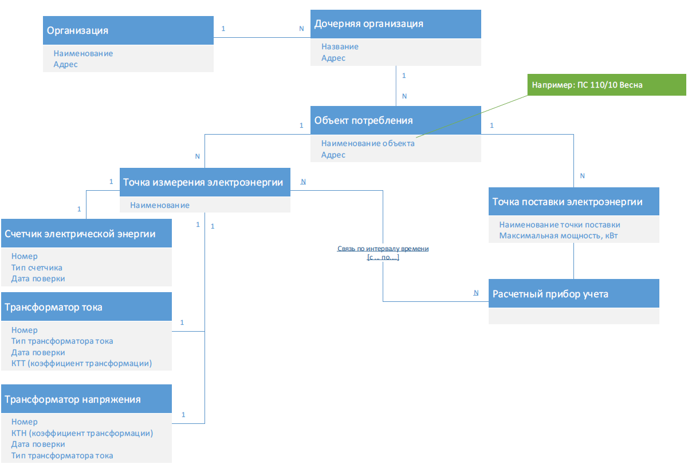

Trans Neft Energo - Power Project
==============================

## Схема модели классов


## Структура решения
+ `WebAPI` - Приложение ASP.Net Core 3.1, реализующее функционал REST Web API;
+ `WebAPI.Test` - Приложение ??? для тестирования;
+ `APITestConsoleApp` - Консольное приложение .Net Core для тестирования функций WebAPI;
+ `Contract` - Содержит набор общих интерфейсов и DTO, используемых на презентационном уровне для приложений `WebAPI` и `APITestConsoleApp`;
    + `Contract.Interfaces` - Содержит набор интерфейсов API для реализации в проектах;
    + `Contract.DTO` - Содержит набор DTO, возвращаемых API;
    + `Contract.Enums` - Содержит перечисления, используемые в API;
+ `Infrastructure` - Содержит контекст БД для EnergoDB, а также класс для начальной инициализации БД, и класс конфигурации контекста;
+ `Domain` - Содержит набор сущностей проекта, интерфейсы для репозитория и сервисов;
+ `Logics` - Определяет уровень бизнес-логики приложения. Содержит реализации репозиториев и сервисов.

## Зависимости

### Внешние зависимости

+ Microsoft.EntityFrameworkCore **v5.0.13** - `Infrastructure`;
+ Microsoft.EntityFrameworkCore.SqlServer **v5.0.13** - `WebAPI`, `Logics`;
+ Microsoft.EntityFrameworkCore.Proxies **v5.0.13** - `Logics`;
+ Microsoft.AspNetCore.Mvc.Core **v2.2.5** - `Contract.Interfaces`;
+ Microsoft.AspNetCore.Mvc.NewtonsoftJson **v3.1.22** - `WebAPI`;
+ Swashbuckle.AspNetCore **v6.2.3** - `WebAPI`;
+ Refit **6.1.15** - `APITestConsoleApp`, `Contract.Interfaces`;
+ Refit.Newtonsoft.Json **6.1.15** - `APITestConsoleApp`;
+ Newtonsoft.Json **13.0.1** - `Contract.DTO`;


### Ссылки на проекты

| Проект | Зависимости |
| :---: | :---: |
| `WebAPI`             | `Infrastructure`, `Contract.Interfaces`, `Contract.Enums` |
| `WebAPI.Test`        | |
| `APITestConsoleApp` | `Contract.Interfaces`, `Contract.DTO`, `Contract.Enums` |
| `Contract.Interfaces` | `Contract.DTO` |
| `Contract.DTO`       | `Contract.Enums` |
| `Contract.Enums`     | |
| `Infrastructure`      | `Domain` |
| `Domain`              | |
| `Logics`              | `Domain`, `Infrastructure`, `Contract.DTO` |

## Заметки
+ Сущности `Организация` и `Дочерняя организация` можно было бы объединить в одну, с указанием в отдельном столбце вида организации, однако, так как на схеме модели классов указаны обе сущности, в проекте они также реализованы раздельно;
+ Данные в проекте для большинства сущностей нормированы по 3-й н.ф., в связи с чем добавлены таблицы для типа трансформатора и типа счётчика;
+ `Номер счётчика` и `номер трансформатора`, хоть и могут с хорошей вероятностью быть различными, они всё же не могут считаться уникальными, в связи с чем в сущностях `Счётчик электрической энергии`, `Трансформатор тока` и `Трансформатор напряжения` введены ключевые поля `Id`.
+ Сущность `Расчётный прибор учёта`, согласно схеме, не содержит в себе данных, а `связь по интервалу времени` не указывает на конкретные поля у связываемых сущностей. В связи с этим предлагается следующая реализация сущности `Расчетный прибор учета` в виде класса `AccountingDeviceInfo`:
    + Сущность представляет описание потреблённого количества энергии (`ConsumedElectricity`), измеренного точкой измерения электроэнергии (`EMeasuringPoint`) и поставленного точкой поставки электроэнергии (`ESupplyPoint`) за заданный интервал времени (`Interval_From` и `Interval_To`).
+ В качестве альтернативного подхода к проектированию можно было бы вынести общие для точки измерения и трансформаторов данные в отдельную сущность (например, номер, тип, дату поверки).

## Запуск
Запускаемым проектом в решении назначен `TNEPowerProject.WebAPI`. Приложение запускает веб-сервер Kestrel на порту `8080` для http (с редиректом на https) и на порту `8081` для https. Для быстрого теста API можно воспользоваться подключенным к проекту Swagger'ом. Чтобы запустить тестирующее API консольное приложение необходимо собрать решение и запустить следующий файл, находящийся в корне решения:

```(txt)
RunTestApp.bat
```

## Дальнейшее развитие
+ Использование [AutoMapper'a](https://automapper.org/) для ускорения написания кода для DTO;